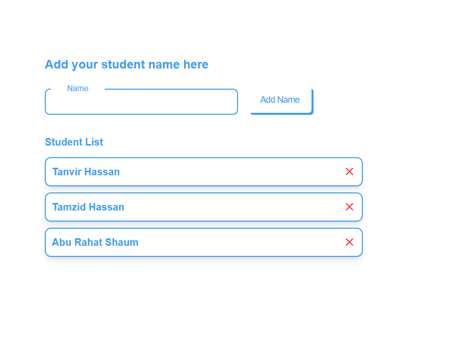

# 🧑‍🎓  Practics Zustand (

A modern **Next.js** application that uses **Zustand** for state management and React Hook Form to manage a list of students. You can add and remove students, with data persisted in localStorage using Zustand's `persist` middleware.

---

## 🖥️ UI Preview




## 🚀 Tech Stack

- ⚛️ **Next.js** 15.4.1
- 🧵 **Zustand** 5.0.6 (with `persist` + `createJSONStorage`)
- 📋 **React Hook Form** 7.60.0
- 🎨 **Lucide React** (icons)
- 🧠 **React** 19.1.0
- 💾 **localStorage** (via Zustand middleware)

---

## 📦 Installation

```bash
git clone https://github.com/your-username/student-management-app.git
cd student-management-app
npm install
npm run dev
